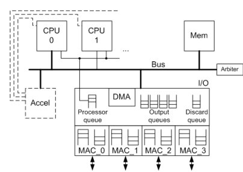

# SystemC-Laboratory

This repo is the code used for the systemc laboratory provided by TUM. In this lab, the goal is to understand how systems are modelled using systemc.
There are two main parts of this repo: 
- The first part familiarizes us with the usage of systemc by modelling a FIFO buffer
- The second part implements the transactions of a Network Processor Architecture (NPU) where packets are routed to and from the model

## Requirements

To use this repo, systemc and a compiler is necessary. The compiler used during development is g++ which can be used as reference when testing out the repo.
Installations of systemC can be done through the following commands for a linux file system (tested for Ubuntu 18.04.4 and 20.04.1):

```
mkdir objdir
sudo mkdir /usr/local/systemc-2.3.3
cd objdir
sudo apt-get install build-essential libpcap-dev
../configure --prefix=/usr/local/systemc-2.3.3
make
sudo make install
```

## Code

Included in the code are the makefiles required for the compilation. The generated files can then be executed to checkout the simulation. In certain cases, a trace file (.vcd) will be generated for further analysis of the model's behaviors.

## First part

In the first part, we model 4 different type of FIFO buffers. The key differences in them is the amount of latency between writing a word to reading that same word. The models can be named as the following: 
- Simple FIFO model (a basic FIFO model where read and write can be considered completely separate) -> ex 2a
- Low latency FIFO model / First-word-fall-through(FWFT) FIFO (this FIFO directly outputs the next word to be read and uses a valid flag) -> ex 2b
- FIFO model with SC_Interface (similar to previous one but here we use sc_interface for the implementation instead of signal/event) -> ex 3
- FIFO model with TLM 2.0 (TLM 2.0 is used to showcase how much simpler it is to model communications during early exploration phases) -> ex 4

The comparison of the 4 models can be analysed in exercise 5, where the amount of time it takes to process a certain amount of data is measured and compared to each other.

## Second part

In the second part, we model a network processor step by step. The NPU acts as an internet router with four Ethernet ports and performs simple IP forwarding (IPv4). The main task of the NPU is to determine where to forward incoming packets (determined by IP address in IP header). The architecture of the network processor can be viewed in the following image.



The modelling is divided into the following subtasks:
- In exercise 6, we first implement the SC_THREAD process process_thread. This process should read a packet descriptor from the processor queue and write it randomly to one of the four output queues
- In exercise 7, the actual packet processing is added to the model. Therefore the IP header of the IP packet needs to be processed to figure out the output port.
- In exercise 8, timing annotations of the different processing steps within the CPU are headed. This helps get a better analysis of the signal communications and the timing behavior.
- In exercise 9, a new model called the accelerator is added into the model. This "accelerator" can be viewed as an application specific hardware that can be used to speed up parts of the process (specifically the next-hop lookup part).

Finally in exercise 10 we analyze the behavior of the model for different number of CPUs, the CPU frequency, the bus clock frequency, and the presence or absence of the accelerator for doing the lookup.